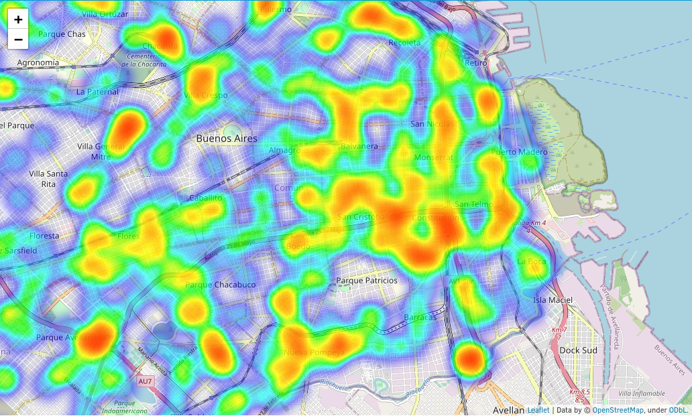

# Data ANALITICS / Proyecto Individual N#2

Como analista de datos, mi rol es recopilar, limpiar e interpretar datos para resolver problemas y tomar decisiones informadas. 
En este caso, el dataset que estoy estudiando incluye información sobre accidentes viales en la Ciudad Autónoma de Buenos Aires (CABA) ocurridos entre 2016 y 2021. 
Mi objetivo es encontrar patrones y tendencias en los datos que puedan ayudar a mejorar la seguridad vial en la zona.

Este repo es mi solucion a las consignas del repo de Data Analitics: https://github.com/soyHenry/PI_DA/

## Estructura del proyecto:

            |
            |__* Data:       Carpeta con datasets
            |
            |__* Notebooks:  notebook.ipynb
            |                
            |__* Codigo:     main.py

## DESARROLLO

Para desarrollar el proyecto, realicé un análisis de los datos con Jupyter Notebooks y luego utilicé parte del código para crear un dashboard interactivo con Streamlit. 
El dashboard incluye análisis de datos, un mapa con datos geográficos y la posibilidad de realizar consultas a una base de datos SQL.

## Deploy con Streamlit

En el siguiente link se puede explorar el proyecto.
Link: https://uery2mavx8wab4cgor743k.streamlit.app/

## Funcionalidad de Mapa

